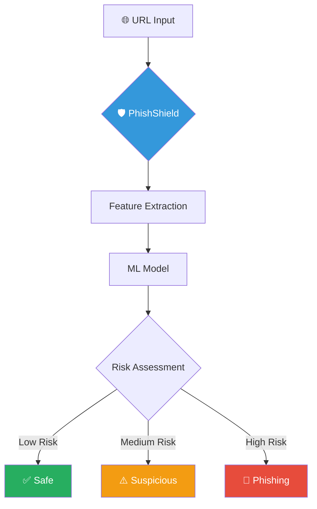
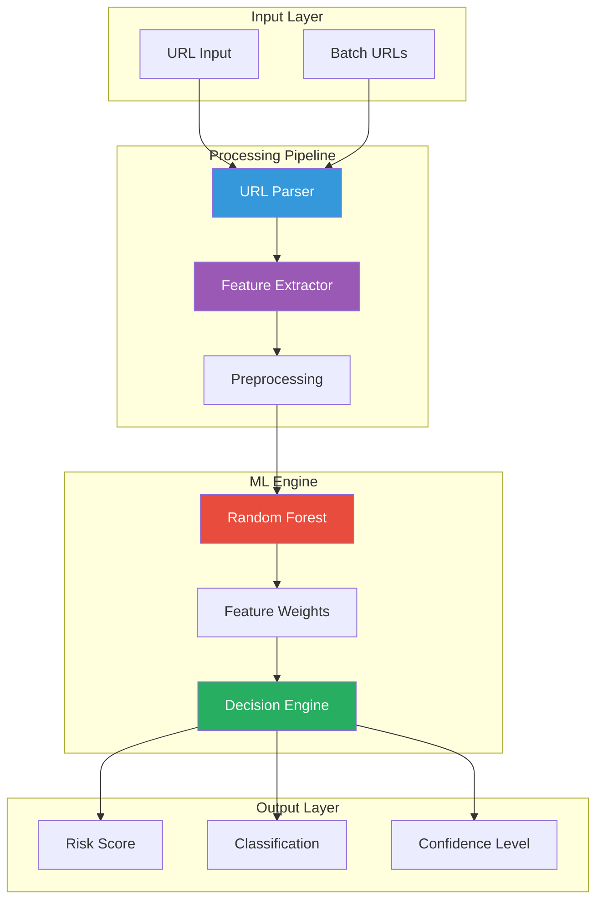
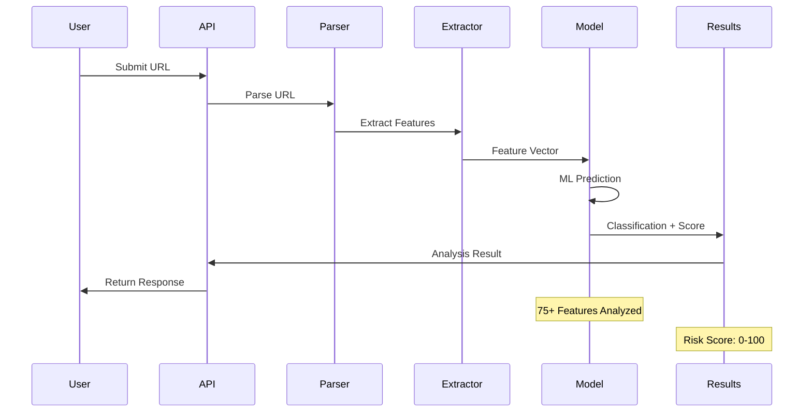
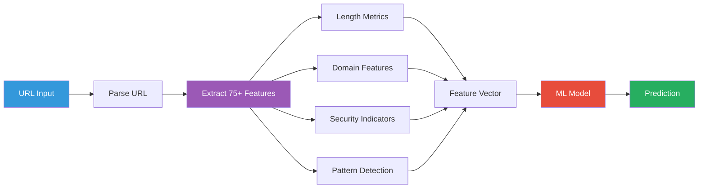
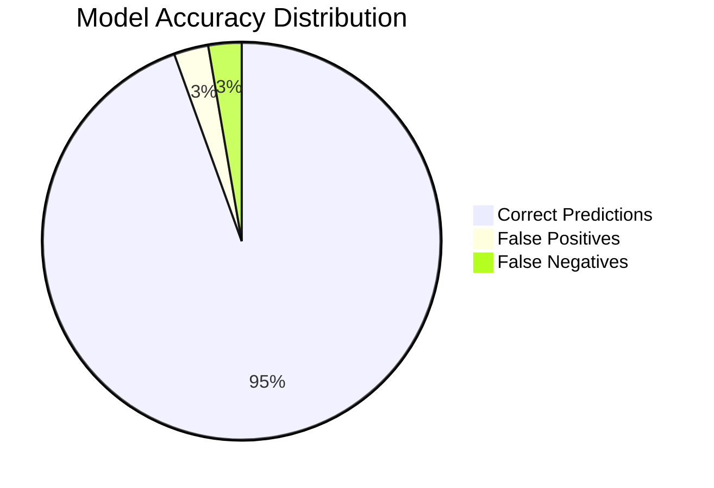
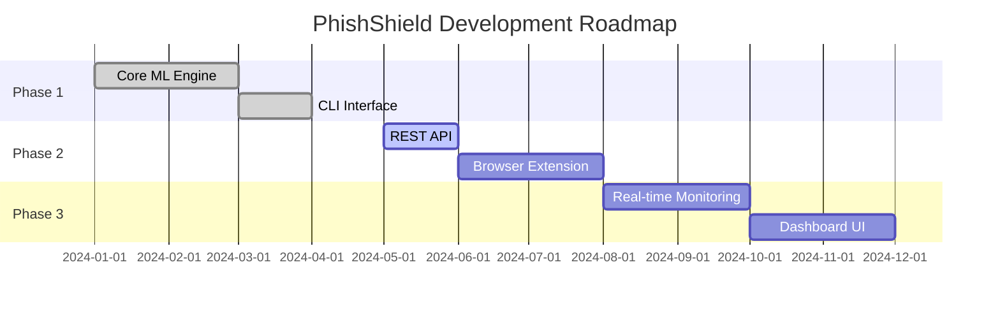
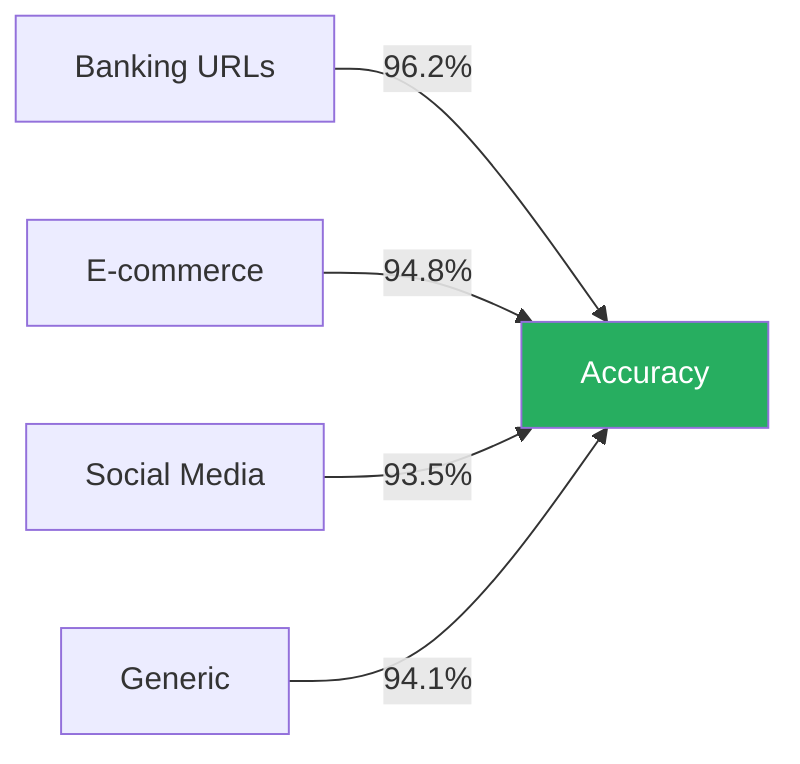

# 🛡️ PhishShield - Advanced Phishing Detection

<div align="center">


### 🔥 Machine Learning-Powered URL Threat Detection

<p align="center">
  <a href="https://python.org"></a>
  <a href="#"></a>
  <a href="LICENSE"></a>
  <a href="#"></a>
</p>

<p align="center">
  
  
  
</p>

**✨ ML-Powered Detection • 🚀 Fast Analysis • 🎯 High Accuracy**

<p align="center">
  <a href="#-quick-start">Quick Start</a> •
  <a href="#-features">Features</a> •
  <a href="#-how-it-works">How It Works</a> •
  <a href="#-usage">Usage</a> •
  <a href="#-contributing">Contributing</a>
</p>

</div>

---

## 🎯 Overview

<table>
<tr>
<td width="60%">

PhishShield is an **advanced machine learning system** designed to detect phishing URLs with high accuracy. By analyzing over **75+ URL features** and applying sophisticated ML algorithms, it provides robust protection against phishing attacks.

### 💡 Why PhishShield?

- **🤖 ML-Powered**: Trained on thousands of phishing and legitimate URLs
- **⚡ Fast Analysis**: Process URLs in milliseconds
- **🎯 Feature-Rich**: Analyzes 75+ distinct URL characteristics  
- **🔧 Easy Integration**: Simple Python API and CLI interface
- **📊 Transparent Results**: Clear confidence scores and risk indicators

</td>
<td width="40%">



</td>
</tr>
</table>

---

## ✨ Features

<div align="center">

| 🔍 **Detection** | 🧠 **Intelligence** | 🛠️ **Tools** |
|------------------|---------------------|---------------|
| URL Structure Analysis | Machine Learning Models | Python API |
| Domain Characteristics | 75+ Feature Extraction | Command Line Interface |
| Pattern Recognition | Confidence Scoring | Batch Processing |
| Special Character Detection | Risk Assessment | JSON/CSV Export |

</div>

### 🚀 Core Capabilities

<details>
<summary><b>🔍 Advanced URL Analysis</b></summary>

- **URL Structure**: Length, depth, special characters, suspicious patterns
- **Domain Features**: TLD analysis, subdomain count, domain entropy
- **Security Indicators**: HTTPS presence, URL shorteners, IP address usage
- **Content Patterns**: Suspicious keywords, brand impersonation detection
- **Behavioral Signals**: Redirect chains, port numbers, URL obfuscation

</details>

<details>
<summary><b>🧠 Machine Learning Models</b></summary>

- **Random Forest Classifier**: Ensemble learning for robust predictions
- **Feature Engineering**: 75+ automatically extracted features
- **Training Pipeline**: Continuous model improvement capability
- **Cross-Validation**: Rigorous testing for accuracy
- **Model Persistence**: Pre-trained models included

</details>

<details>
<summary><b>🛠️ Developer Tools</b></summary>

- **Python API**: Simple integration into applications
- **CLI Interface**: Quick command-line analysis
- **Batch Processing**: Analyze multiple URLs efficiently
- **Multiple Output Formats**: JSON, CSV, plain text
- **Logging**: Configurable logging levels

</details>

---

## 🏗️ Architecture

<div align="center">

### 📊 System Architecture



### 🔄 Analysis Flow



</div>

---

## 🚀 Quick Start

### 📦 Installation

```bash
# Clone the repository
git clone https://github.com/LuthandoCandlovu/phishing-detector.git
cd phishing-detector

# Create virtual environment
python -m venv venv
source venv/bin/activate  # Windows: venv\Scripts\activate

# Install dependencies
pip install -r requirements.txt
```

### ⚡ Quick Test

```python
from phishshield import URLAnalyzer

# Initialize analyzer
analyzer = URLAnalyzer()

# Analyze a URL
result = analyzer.analyze("https://suspicious-site.com")

print(f"🎯 Classification: {result.classification}")
print(f"📊 Risk Score: {result.risk_score}/100")
print(f"💯 Confidence: {result.confidence:.1%}")
```

---

## 💻 Usage

### 🐍 Python API

<table>
<tr>
<td width="50%">

**Basic Analysis**

```python
from phishshield import URLAnalyzer

analyzer = URLAnalyzer()

# Simple check
result = analyzer.analyze(
    "https://example.com"
)

if result.is_phishing:
    print("⚠️ Phishing Detected!")
    print(f"Risk: {result.risk_score}/100")
else:
    print("✅ URL appears safe")
```

</td>
<td width="50%">

**Batch Processing**

```python
from phishshield import URLAnalyzer

analyzer = URLAnalyzer()

urls = [
    "https://site1.com",
    "https://site2.com",
    "https://site3.com"
]

results = analyzer.analyze_batch(urls)

for url, result in results.items():
    print(f"{url}: {result.classification}")
```

</td>
</tr>
</table>

### 🖥️ Command Line Interface

```bash
# Analyze single URL
python main.py --url "https://example.com"

# Analyze from file
python main.py --file urls.txt --output results.json

# Detailed analysis with verbose output
python main.py --url "https://example.com" --verbose --format json

# Batch processing with progress
python main.py --file urls.txt --batch --progress
```

### 📊 Output Examples

<details>
<summary><b>JSON Output Format</b></summary>

```json
{
  "url": "https://suspicious-login-verify.com",
  "analysis": {
    "is_phishing": true,
    "classification": "PHISHING",
    "risk_score": 87,
    "confidence": 0.94
  },
  "features": {
    "url_length": 45,
    "has_ip": false,
    "https_present": true,
    "suspicious_words": ["login", "verify"],
    "domain_age_days": 12
  },
  "timestamp": "2024-11-24T10:30:00Z"
}
```

</details>

---

## 🔬 How It Works

<div align="center">

### 📈 Feature Extraction Process



</div>

### 🎯 Key Features Analyzed

<table>
<tr>
<td width="33%">

**📏 URL Structure**
- URL length
- Number of dots
- Special characters
- Path depth
- Query parameters

</td>
<td width="33%">

**🌐 Domain Analysis**
- TLD type
- Subdomain count
- Domain entropy
- Suspicious patterns
- Brand similarity

</td>
<td width="33%">

**🔒 Security Checks**
- HTTPS usage
- Certificate validity
- IP address presence
- URL shortener detection
- Port number analysis

</td>
</tr>
</table>

### 🧮 ML Model Performance



<table align="center">
<tr>
<th>Metric</th>
<th>Score</th>
<th>Description</th>
</tr>
<tr>
<td>Accuracy</td>
<td><b>94.5%</b></td>
<td>Overall correct predictions</td>
</tr>
<tr>
<td>Precision</td>
<td><b>93.2%</b></td>
<td>True phishing among detected</td>
</tr>
<tr>
<td>Recall</td>
<td><b>95.1%</b></td>
<td>Phishing URLs detected</td>
</tr>
<tr>
<td>F1 Score</td>
<td><b>94.1%</b></td>
<td>Harmonic mean of precision/recall</td>
</tr>
</table>

---

## 📁 Project Structure

```
phishing-detector/
├── 📂 src/
│   ├── analyzer.py          # Main analysis engine
│   ├── features.py          # Feature extraction
│   ├── models.py            # ML model management
│   └── utils.py             # Utility functions
├── 📂 data/
│   ├── training/            # Training datasets
│   ├── models/              # Saved ML models
│   └── test/                # Test datasets
├── 📂 tests/
│   ├── test_analyzer.py     # Unit tests
│   └── test_features.py     # Feature tests
├── 📂 docs/
│   ├── API.md               # API documentation
│   └── TRAINING.md          # Model training guide
├── main.py                  # CLI entry point
├── requirements.txt         # Dependencies
├── setup.py                 # Package setup
└── README.md               # This file
```

---

## 🔧 Configuration

Create `config.yaml` to customize behavior:

```yaml
analysis:
  timeout: 5
  max_redirects: 3
  user_agent: "PhishShield/1.0"

model:
  confidence_threshold: 0.85
  risk_score_weights:
    url_features: 0.4
    domain_features: 0.3
    security_features: 0.3

logging:
  level: INFO
  format: "%(asctime)s - %(name)s - %(levelname)s - %(message)s"
  file: "phishshield.log"
```

---

## 🧪 Development

### Running Tests

```bash
# Install development dependencies
pip install -r requirements-dev.txt

# Run all tests
pytest tests/ -v

# Run with coverage
pytest --cov=src --cov-report=html tests/

# Run specific test
pytest tests/test_analyzer.py::test_phishing_detection -v
```

### Training Custom Models

```bash
# Train new model with your dataset
python scripts/train.py \
  --data data/training/urls.csv \
  --output models/custom_model.pkl \
  --test-split 0.2

# Evaluate model performance
python scripts/evaluate.py --model models/custom_model.pkl
```

---

## 🗺️ Roadmap



- [x] Core ML detection engine
- [x] Feature extraction pipeline
- [x] CLI interface
- [x] Batch processing
- [ ] REST API service
- [ ] Browser extension
- [ ] Real-time URL monitoring
- [ ] Web dashboard
- [ ] Email integration
- [ ] Multi-language support

---

## 🤝 Contributing

Contributions are welcome! Here's how you can help:

<div align="center">

| 🐛 Report Bugs | 💡 Suggest Features | 🔧 Submit PRs |
|----------------|---------------------|---------------|
| [Create Issue](https://github.com/LuthandoCandlovu/phishing-detector/issues) | [Discussions](https://github.com/LuthandoCandlovu/phishing-detector/discussions) | [Pull Requests](https://github.com/LuthandoCandlovu/phishing-detector/pulls) |

</div>

### Development Workflow

1. Fork the repository
2. Create feature branch (`git checkout -b feature/amazing-feature`)
3. Commit changes (`git commit -m 'Add amazing feature'`)
4. Push to branch (`git push origin feature/amazing-feature`)
5. Open Pull Request

---

## 📊 Performance Metrics

<div align="center">

### ⚡ Speed Benchmarks

| Operation | Average Time | Throughput |
|-----------|-------------|------------|
| Single URL Analysis | ~15ms | 65 URLs/sec |
| Feature Extraction | ~8ms | - |
| ML Prediction | ~5ms | - |
| Batch (100 URLs) | ~1.2s | 83 URLs/sec |

### 📈 Accuracy by URL Type



</div>

---

## ⚠️ Limitations

- Detection accuracy depends on training data quality
- May have false positives on unusual legitimate URLs
- Cannot analyze password-protected content
- Requires periodic model retraining for new phishing patterns
- Limited support for non-English domains

---

## 📄 License

This project is licensed under the MIT License - see the [LICENSE](LICENSE) file for details.

---

## 🙏 Acknowledgments

<div align="center">

**Built with:**

[](https://python.org)
[](https://scikit-learn.org)
[](https://pandas.pydata.org)
[](https://numpy.org)

**Data Sources:**
- [PhishTank](https://www.phishtank.com/) - Phishing URL database
- [OpenPhish](https://openphish.com/) - Threat intelligence
- [URLhaus](https://urlhaus.abuse.ch/) - Malware URL tracking

</div>

---

## 📞 Support

<div align="center">

| 📚 Documentation | 🐛 Issues | 💬 Discussions |
|------------------|-----------|----------------|
| [Read the Docs](https://github.com/LuthandoCandlovu/phishing-detector/wiki) | [Report Bug](https://github.com/LuthandoCandlovu/phishing-detector/issues) | [Join Discussion](https://github.com/LuthandoCandlovu/phishing-detector/discussions) |

---

**⭐ If you find this project useful, please consider giving it a star!**

[](https://github.com/LuthandoCandlovu/phishing-detector)

---

<sub>Made with ❤️ by the Security Community | © 2024 PhishShield</sub>

</div>
